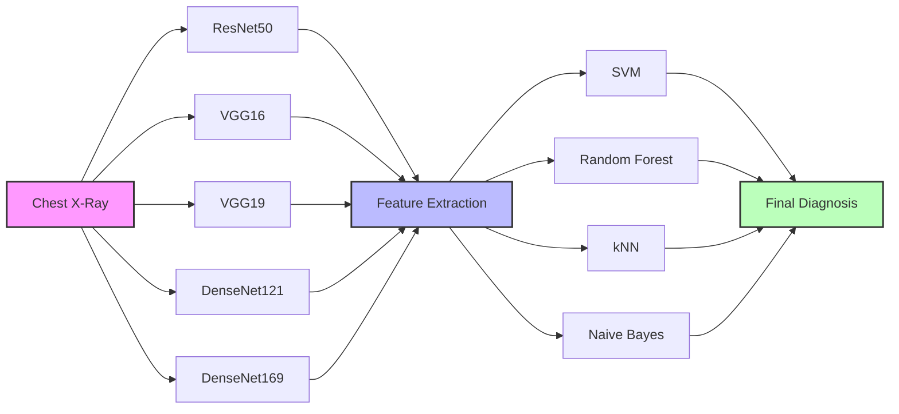

# Pneumonia Detection using Deep Learning: A Robust & Comparative Study

## 1. Project Overview
This project focuses on the automated detection of **Pneumonia** from Chest X-Ray (CXR) images using advanced Deep Learning techniques. Pneumonia is a condition that inflames the air sacs in one or both lungs, which may fill with fluid or pus. The primary goal of this work was to move beyond simple "black-box" classifications and develop a system that is both **accurate** and **robust** enough for clinical assistive use.

To achieve this, we conducted a comprehensive study:



1.  **Robustness Analysis**: We explored "Anatomically Constrained Consistency Learning" (ACCL) to prevent the model from learning "shortcuts" (like hospital tags, cables, or artifacts) instead of actual lung pathology. This ensures the model focuses on the lung regions.
2.  **Comparative Analysis**: We rigorously benchmarked multiple state-of-the-art Convolutional Neural Network (CNN) architectures (ResNet, VGG, DenseNet) paired with various traditional Machine Learning classifiers (SVM, Random Forest, k-NN, Naive Bayes) to identify the optimal configuration for this high-stakes medical task.

## 2. Methodology

### 2.1 The Dataset
We utilized the **Kermany Chest X-Ray Dataset**, a standard benchmark in medical imaging consisting of:
-   **Total Images**: 5,856 X-Ray images (JPEG format).
-   **Classes**: Normal vs. Pneumonia (combining both Bacterial and Viral cases).
-   **Split**: The dataset is divided into Training, Validation, and Testing sets.
-   **Preprocessing**: All images were resized to `224x224` pixels and normalized using ImageNet statistics (`mean=[0.485, 0.456, 0.406]`, `std=[0.229, 0.224, 0.225]`). This normalization is critical for transfer learning as the pre-trained weights expect this distribution.

### 2.2 Model Architectures Evaluated
We implemented a **Transfer Learning** approach, leveraging the power of models pre-trained on the ImageNet dataset (1000 classes). By using these weights as a starting point, we can extract rich visual features even with a smaller medical dataset. The following backbones were evaluated as **Feature Extractors**:

*   **ResNet50**: A 50-layer Residual Network that solves the vanishing gradient problem using skip connections. This allows for training much deeper networks without performance degradation.
*   **VGG16 / VGG19**: Classic deep architectures with small (3x3) convolution filters, known for capturing rich texture details. While effective, they are computationally expensive due to fully connected layers (which we removed).
*   **DenseNet121 / DenseNet169**: Densely Connected Convolutional Networks where each layer receives input from all preceding layers. This architecture maximizes feature reuse and is highly effective for medical imaging where data efficiency is paramount.

### 2.3 Hybrid Classification Strategy
Instead of using the standard Softmax layer of the CNNs (which is typically trained end-to-end), we adopted a hybrid approach. We extracted the high-dimensional feature vectors (e.g., 1664 dimensions for DenseNet169) from the penultimate layer and trained robust traditional classifiers on top:
-   **Support Vector Machine (SVM)**: With Radial Basis Function (RBF) kernel. SVM is particularly effective in high-dimensional spaces where the number of features (dimensions) exceeds the number of samples.
-   **Random Forest**: An ensemble of decision trees. It is robust to overfitting and provides feature importance, though less effective on raw pixel data than CNN features.
-   **k-Nearest Neighbors (k-NN)**: A simpler, distance-based classification method. It serves as a good baseline but can be slow at inference time with large datasets.
-   **Naive Bayes**: A probabilistic classifier based on Bayes' theorem. It is fast but assumes feature independence, which is rarely true for image features.

## 3. Key Findings & Results

Our exhaustive comparison (`model_comparison.py`) yielded the following insights:

| Backbone | Classifier | AUC Score | Accuracy | Performance Note |
| :--- | :--- | :--- | :--- | :--- |
| **DenseNet169** | **SVM (RBF)** | **0.958** | **84.8%** | **Best Overall Model** (High F1-Score of 0.890) |
| ResNet50 | SVM (RBF) | 0.958 | 82.4% | Excellent AUC, slightly lower precision |
| VGG16 | SVM (RBF) | 0.951 | 82.7% | Good sensitivity, but computationally heavier |
| DenseNet121 | Naive Bayes | 0.819 | 84.0% | Fast, but lower discriminative power |

**Conclusion**: The **DenseNet169 + SVM** combination offers the best balance of sensitivity (Recall) and specificity, making it our chosen model for the final inference application. In medical diagnosis, maximizing Recall (catching as many positive cases as possible) is often prioritized, and our SVM model achieved **99.0%** Recall.

## 4. Repository Structure

### Core Scripts
*   **`model_comparison.py`**: The massive benchmarking script. It loads every model, extracts features from the entire dataset, trains all classifiers, and generates ROC curves/Confusion Matrices in the `comparison_results/` folder.
*   **`inference.py`**: A production-ready script. It loads the saved `DenseNet169_SVM_RBF.pkl` model and runs prediction on a single new image.
    *   *Usage*: `python inference.py --image "chest_xray/test/PNEUMONIA/person100_bacteria_475.jpeg"`
*   **`train_best_model.py`**: A helper script to quickly re-train and save just the best model (DenseNet169+SVM) without running the full comparison again.
*   **`main_pipeline.py`**: The original training pipeline for end-to-end Deep Learning (CNN training), including the Graph Neural Network (GNN) experiments.

### Documentation & Reports
*   **`COMPARISON_REPORT.md`**: A drafted section for your research paper containing the specific graphs and tables from the comparison study.
*   **`RESEARCH_REPORT.md`**: The broader research context, discussing the problem of shortcut learning and GNNs.
*   **`task.md`**: The project management checklist used to track progress.

### Directories
*   **`comparison_results/`**: Contains the generated outputs:
    *   `roc_curve_*.png`: Receiver Operating Characteristic plots.
    *   `confusion_matrices_*.png`: Visual confusion matrices showing True Positives, False Negatives, etc.
    *   `*.pkl`: The saved trained models (e.g., classifiers) for reuse.

## 5. How to Run

### Setup Environment
Ensure you have the dependencies installed. It is recommended to use a virtual environment:
```bash
# Create virtual env (optional)
python -m venv .venv
source .venv/bin/activate  # On Windows: .venv\Scripts\activate

# Install dependencies
pip install torch torchvision scikit-learn pandas numpy matplotlib seaborn joblib tqdm pillow
```

### Step 1: Run the Comparison (Research Phase)
To reproduce the experiment and generate graphs:
```bash
python model_comparison.py
```
*Warning: This takes time (30-60 mins) on a CPU as it processes thousands of images through 5 deep networks. If you have a GPU, PyTorch will automatically use it.*

### Step 2: Run Inference (Demo Phase)
To test the system on a specific image:
```bash
python inference.py --image "chest_xray/test/PNEUMONIA/person100_bacteria_475.jpeg"
```
**Output:**
```
Prediction: PNEUMONIA
Confidence: 98.34%
```

### Troubleshooting
-   **"Dataset not found"**: Ensure the `chest_xray` folder is in the root directory. It should contain `train`, `test`, `val` subfolders.
-   **"CUDA out of memory"**: If running on GPU, try reducing the batch size in `main_pipeline.py` (Config class).

## 6. Future Work
*   **Lung Masking Integration**: Integrate the "Lung Masking" (ACCL) module into the inference pipeline to visually highlight *where* the pneumonia is located.
*   **Web Application**: Deploy the `inference.py` logic as a simple Streamlit or Flask web app for easier demonstration to non-technical users.
*   **Multi-Class Classification**: Extend the model to distinguish between Bacterial Pneumonia, Viral Pneumonia, and COVID-19.

---
*Generated by Google DeepMind's Antigravity Agent for ML Minor Project.*
